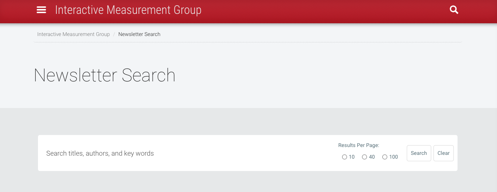
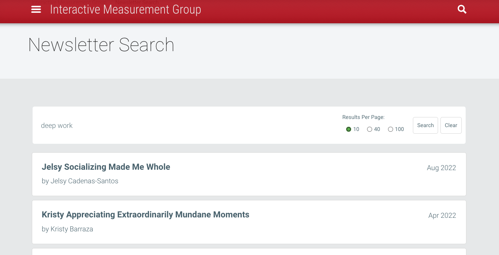
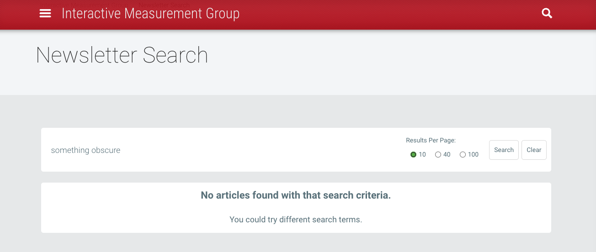

# Newsletter Search App

=== OVERVIEW ===

== The Project ==

A client-requested freelance project, Newsletter Search App adds search functionality to the [Interactive Measurement Group](https://img.faculty.unlv.edu/lab/)’s website for their lab newsletter: *Connections: Word from the Interactive Measurement Group*. The client requested that the app be integrated with their existing Wordpress site and to minimize any extra work on the part of the client. After learning about the newsletter workflow and doing extensive research on React and Wordpress integration, I was able to integrate the app into the existing workflow without the client needing to take any additional steps. 

== The App ==

Newsletter Search App is a single-page React application that leverages the Wordpress REST API to render newsletter article links as components. It features the ability to search newsletter pages on the existing [Interactive Measurement Group](https://img.faculty.unlv.edu/lab/) lab website, set specific results per page returns, pagination for returned results, and integration of React and Wordpress via ReactPress and LocalWP. The app demonstrates complex error handling, a responsive mobile-first design, and integration with the existing Mars UNLV Wordpress Theme. 

== Lessons and Takeaways ==

It was exciting to build an app for an existing user base. The *Connections* newsletter has 245+ subscribers and 30+ active contributors; I am thrilled to have contributed software that makes the navigation of newsletter pages simpler for this network. 

Additionally, I learned a lot about how to integrate modern technologies (like React) into a Wordpress framework. The project was a challenging and rewarding experience that both broadened my understanding of the React and Wordpress ecosystems and expanded my ability to provide solutions to client problems. 

=== LINK TO LIVE SITE ===

You can access the *Connections* newsletter search feature and begin exploring newsletter articles [here](https://img.faculty.unlv.edu/lab/newsletter-search/).

=== MAIN TECHNOLOGIES ===

- Javascript
- JSX/CSS
- React
- [Wordpress REST API](https://developer.wordpress.org/rest-api/)
- [ReactPress](https://wordpress.org/plugins/reactpress/)
- [LocalWP](https://localwp.com/)

=== PICTURES OF APP ===

This project was bootstrapped with [Create React App](https://github.com/facebook/create-react-app).
